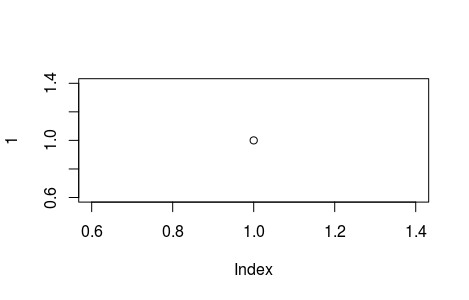

```{r pacotes, include=FALSE}
if (!require("vegan")) install.packages("vegan")
if (!require("knitr")) install.packages("knitr")
```

<!-- https://github.com/citation-style-language/styles -->

# Filiação

# Resumo

# Intro



<!-- 
~~Eu~~ adoro *bolo* de **chocolate**. 
lklçfdsgjçlskfdjglçksfjglçkjsfdçlkgjçsflkgj
-->

H~2~O

nome^2^


- Item 1
  - Item 1.1

- Item 2

+ Item 3

1. Item
  1.1 Item não sei o número

2. Item

# M&M

## Coleta de dados

## Análise de dados


# Resultados

A tabela *mtcars* tem `r nrow(mtcars)` linhas.

```{r, echo=FALSE, eval=TRUE}
data("mtcars")
kable(mtcars)
```


A cerquinha abaixo não mostra o código nem o resultado dele.

```{r cerquinha-do-plot, echo=FALSE, eval=FALSE}
plot(1)
```

A cerquinha abaixo mostra o código mas nã mostra o resultado dele.

```{r, echo=TRUE, eval=FALSE}
plot(1)
```

A cerquinha abaixo mostra o código e o resultado dele.

```{r, echo=TRUE, eval=TRUE, fig.cap="Meu plot"}
plot(1)
```

A cerquinha abaixo não mostra o código mas mostra o resultado dele.

```{r, echo=FALSE, eval=TRUE}
plot(1)
```


# Discussão

Estou citando fulano [@Turcotte2016].

Segundo @Turcotte2016, isso pode acontecer.

Estou citando várias pessoas que fizeram isso [@Chahouki2010; @Leps1990].

```{r, echo=FALSE, eval=TRUE, fig.cap="Figura 1. Meu plot"}
plot(1)
```


# Referências
